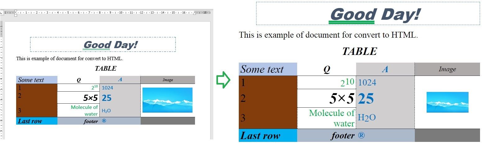

# docx_microreader  _(is under development)_

Module for processing docx documents: 
* convert to text, HTML or other formats;
* extract images;
* changes docx files;
* create documents;

_etc._

All these and some other features will be available after the release of the first version of the module (presumably in early 2022)
However, at the moment this module can already perform some tasks.

## At the moment this module can be used for
* convert docx files or parts of it to HTML 
> behavior of convertation can be managed and changed by 
> inheritance custom classes from special Translator classes and overload their methods

* extract images
> except of background images and some others

* editing and formatting documents
> Although the editing interfaces are not very user-friendly right now. This will be fixed soon.

### Simple example of code for convert docx to HTML
```python
from docx_microreader.models import Document

# by default, the second argument is the folder where the file that is the first argument is located
doc = Document("example.docx", "folder for extracted images")
with open("result.html", "w", encoding="utf-8") as file:
    file.write(doc1.translate("html"))
```
Example of documents: __left__ - docx, __right__ - HTML.


### Simple example of code for editing docx file

Insert word "Text" to paragraphs, that is children of Body of document and haven't runs.

```python
from docx_microreader import models as docx

doc = docx.Document("test/file.docx")

body: docx.Body = doc.get_inner_element(0)
for element in body.iterate_by_inner_elements():
    if isinstance(element, docx.Paragraph) and element.count_inner_elements() == 0:
        new_run = docx.Run.create()
        element.append_inner_element(new_run)
        new_text = docx.Text.create()
        new_text.content = "Text"
        new_run.append_inner_element(new_text)

doc1.save_as_docx("test/result.docx")
```

At the moment __save_as_docx__ method don't save styles of document.
This will be fixed soon.
